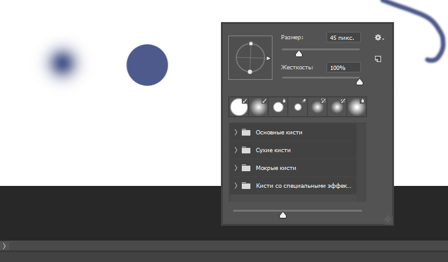

# Урок 1. Учим Photoshop за 1 час! #От​ Профессионала
***Adobe Photoshop*** — многофункциональный графический редактор, разрабатываемый и распространяемый компанией `Adobe Systems`. 
В основном работает с растровыми изображениями, однако имеет некоторые векторные инструменты. 
Мы будем пользоваться русской версией фотошопа, но если нужно то поменять язык можно так: 
`Редактирование` -> `Настройки` -> `Интерфейс` -> `Текст` -> `Язык интерфейса` 

Интерфейс программы очень прост: слева - инструменты, справа - панели, напвигатор 
Но есть функция, которая измененяет рабочую среду и подстраивает интерфейс под ваш род занятий (Рисование, 3D, Графика и Интернет): 
Она находиться сдесь: 

## Создание
Чтобы создать картинку нужно перейти в `Файл` -> `Создать (Ctrl + N)`. После появиться окно **Создать документ**. Тут для нас важны только 4 пункта: 
* Ширина - ширина листа
* Высота - высота листа
* Разрешение - лучше всегда оставлять значение 72, но если вы работаете с файлом, который уйдет в печать, то нужно выставить 300.
* И их измерения - лучше всегда выбирать в **пикселях** 
> так же, там можно выбрать цвет листа, ?цветовой режим? и там же можно дать ему имя 

Панель инструментов можно перемещать куда вздумаетя, еще можно сделать ее в 2 столбика (развернуть) 
У каждого инструмента есть **подинструменты**. Рассмотрим самый банальный инструмент. 
## Кисть

Кисть нужна для того чтобы просто чтото рисовать. Чтобы убрать последнее ваше действие нажните `Ctrl + Z`. Но при еще одном нажатии `Ctrl + Z`
этот убранный элемент снова появиться. Но как удалять историю действий? Сущ. комбинация `Ctrl + Alt + Z`, именно она хронологически удаляет ваши действия (от последнего к первому) 
У кнопки `Caps Lock` есть одно очень интересное св-во, он меняет вид курсора (от круга к крестику). 
Чтобы изменить ***размер*** или ***жесткость*** кисти, нажмите правую клавишу мышки на рабочей зоне. Появиться окно в котором можно изменять эти параметры. **Жесткость** отвечает за четкость контура кисти 

Вы можете видеть, что существуют разные типы кисточек. Можно поэксперементировать. Также существуют кастомные кисти - это кисти которые пользователь может скачивать в интеренете и в последствии добавлять их в интерфейс кисточек. 
## Карандаш

Чтобы воспользоваться этим инструментом, кликаем по иконке кисточки правой кнопкой мыши и выбираем `Инструмент "Карандаш"`. 
**Карандаш** - это тоже самое что и кисть, но рисует он уже не круглежками, а квадратиками + у него нет жескости. Это сделано потому 
что функция карандаша это рисовать на маленьких холстах, то есть нет смысла пользоваться карандашом в размере 100 пикселей, я карандаша норма это 2 пикселя. 
Карандаш в фотошопе используют чтобы нарисовать **пиксель арт**. 
Пиксель арт - это когда вы рисуете квадратиками какие нибудь рисунки. 

## Цвет

Не забываем что в фотошопе можно использовать любую палитру цветов. Изметить цвет вы можете в панели инструмаентов. Этот параметр выглядит как 2 квадрата. 1-й квадрат это передний цвет (тот цвет которыми рисует карандаш и кисть). 
## Приближение и отдаление

В фотошопе есть инструмент который назвается лупа. Нажимайте `Alt` чтобы менять функцию **приближать** и **отдалять**. Чтобы вернуть изображение в нормальный вид, щелкаем на него правой кнопкой мыши и выбираем **Показать во весь экран** 
Как же приближать без этого инструмента? Легко, зажимаем `Alt` и крутим колесиком. 
Так же можно использовать **Навигатор**. Чтобы его включить, нужно перейти во вкладку **Окно**. И там уже щелкнуть на него мышкой. 
## Ластик

Ластик - нужен чтобы стереть не нужные элементы. У него тоже есть размер и жесткость. 
## Геометрические фигуры

Тут все придельно ясно. Просто рисуем фигурки. Если по углам фигуры присутствую какие либо другие элементики, то это может означать, что фигура активна и верхней части окна можно поменять цвет ее заливки, обводки, размер границ и т.д. 
Насчет обводок: 

1. Убирает обводку 2. Чистый цвет 3. Палитра 4. Узор 
Delete - удалить фигуру 
Квадрат можно сделать с помощью верхней панели, но лушче всего зажать `Shift`. 
## Курсор
Как же передвинуть нашу фигуру? С помощью этого инструмента можно поставить фигуру по центру, да и в целом этот инструмент служит для удобного перемещения элементов (при этом на экране могут появлятся различные линии). 
Если у вас нет таких линий-помошников, то переходим:
`Просмотр` -> `Вспомогательные элементы (Включаем эту функцию (Ctrl + H))` -> `Показать` -> `Быстрые направляющие(Включаем)` 

## Пипетка 1
## Соединение линий
## Перемещение объекта
## Перемещение клавишами
## Рука
## Текст
## Выбор текста
## Переход на новую строку
## Заливка
## Градиент
## Пипетка 2
## Слои
## Перемещение фотографии
## Выбор слоя
## Удаление какой-либо части слоя
## Изменение размера слоя
## Вырезка
## Скрыть слой
## Пнг изображения
## Способ увеличения выбранного слоя 

