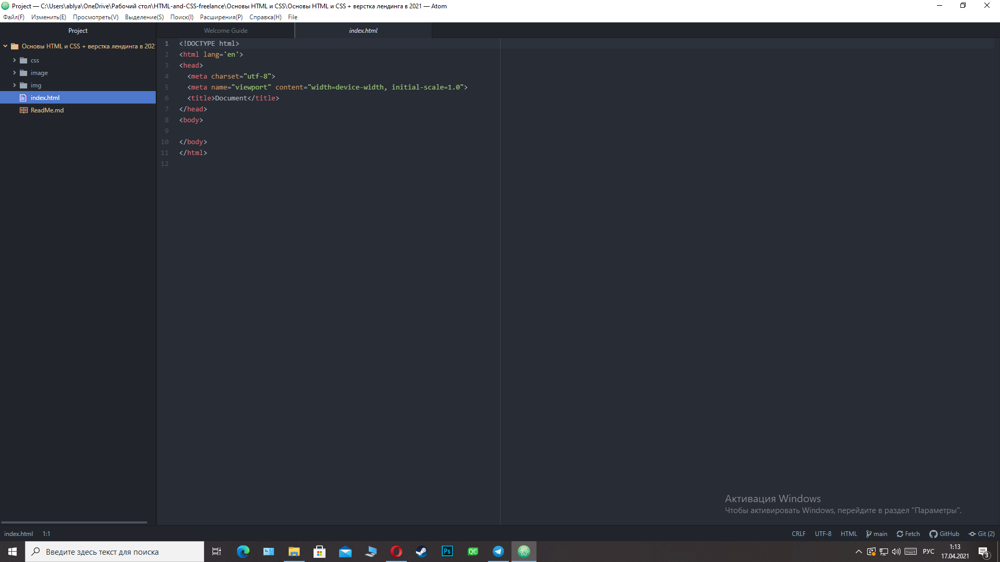
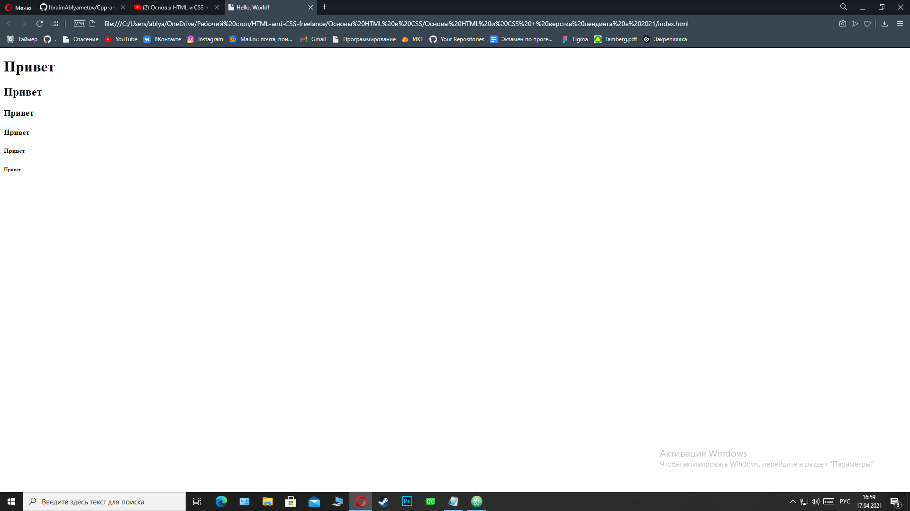

# Основы HTML и CSS + верстка лендинга в 2021
[Ссылка на видео](https://www.youtube.com/watch?v=xuqoe6jzMF0)
***
Итак, перед нами новая среда и новые языки программирования. Я начинаю изучение HTML5 и CSS3. Это это языки напрямую связанные с 
веб-индустрией.  Работать я буду в Atom, это специальная среда для HTML, выглядить она так:<br>



## Приступим к изучению
**HTML** - это язык гиперссылковой разметки. Любая веб-страница это результат написанного кода на этом языке. Он позволяет понимать различным средам(браузеру) понимать
где какие элементы страницы находятся. Его можно назвать базовым каркасом нашей страницы.<br>

Архитектура кода состоит из тегов: `<tag> text </tag>`.<br>
`<tag>` - открывающийся тег.<br>
`</tag>` - закрывающийся тег.<br>
Существуют также теги, которые не закрываются. Например: `<meta>` <br>

Также, у тегов могут быть атрибуты:<br>
`<tag attribute="value">`<br>
В одном теге может быть несколько атрибутов:<br>
`<tag attribute="value" attribute="value" attribute="value">`<br>
**HTML-атрибуты** сообщают браузеру, каким образом должен отображаться тот или иной элемент страницы. **Атрибуты** позволяют сделать более разнообразными внешний вид информации, добавляемой с помощью одинаковых тегов. Значение атрибута заключается в кавычки ""<br>

## Таблица атрибутов


Рассмотрим участок кода с которого начинается верстка и в целом работа с языком (это базовая структура):
```html
Файл index.html:

<!DOCTYPE html>
<html lang='en'>      
<head>
	<meta charset="utf-8">
	<meta name="viewport" content="width=device-width, initial-scale=1.0">
	<title>Document</title>
</head>
<body>
  
</body>
</html>

Файл main.css:
body {
  
}
```
Изучим эту базовую структуру:<br>
`<!DOCTYPE html>` - эта строка показывает браузеру, что данную страницу нужно считывать в формате html.<br>
`<html lang='en'>` - `en` означает, что страница написана (ее контент написан) на английском языке.<br>
`<head></head>` - секция, блок (его еще можно называть **головой**) который не видит человек просматривающий страницу, этот блок необходим только браузеру и разработчику.<br>
`<meta charset="utf-8">` - это строка означает, что страница написана на кодировке `"utf-8"`.<br>

> Кодировку HTML-страницы нужно указывать для того, чтобы веб-браузер мог правильно отображать текст на странице. Если браузер неправильно угадает кодировку, то вместо текста будут отображаться иероглифы. Самая распространённая современная кодировка — utf-8.<br>

`<meta name="viewport" content="width=device-width, initial-scale=1.0">` - эта строка показывает как вести себя браузеру при изменение ширины устройства.<br>
`<title>Document</title>` - это строка, отбражает загаловок страницы. Меняет название верхней вкладки.<br>
`<body></body>` - самый главный блок, в котором содержится весь код страницы.

## Заголовки
Есть разный тип контента, для каждого свой тег. Начнем мы с заголовков. Существует несколько видов заголовков, отличаются они уровнями, а вводятся на страничку в блоке `<body></body>` с помощью тега `<hn></hn>`:<br>
```html
<h1></h1>
<h2></h2>
<h3></h3>
<h4></h4>
<h5></h5>
<h6></h6>
```


Эти заголовки отличаются важностью, иерархией. Самый главный h1, самый неважный h6.<br> Эти заголовки базово имеют разный размер, т.к. где-то там, в браузере, есть встроенные элементы CSS кода.
## Изображение
Тег `` - нужен для того чтобы вывести изображение на страницу. Заметим, что этот тег не является закрывающимся<br>
В атрибут `src=""`, то есть источник мы вписываем адрес картинки.<br> Это делается просто:<br>
* Заходим в интернет
* Скачиваем картинку
* Прописываем путь к этой картинке в атрибут `src=""`<br>
В атрибут `alt=""` мы записываем смысл картинки<dr> Например, картинка с котом имеет смысл "Кот"<br>
Пример:<br>
```html

```


## Ссылки
Тег <a href=""></a> - нужен для того чтобы вывести ссылку на страницу. Это тег является закрывающимся<br>
В атрибут `href=""` записываем ссылку, но нужно писать его с протоколом, вот так `https://www.youtube.com/watch?v=xuqoe6jzMF0` <br>
Также, что не мало важно, мы можем добавить атрибут `target=""` и дать ему значение `target="_blank"`. Это позволит создать новое окно.<br>
Между тегами нужно написать текст, нажав на который нас перебросит на сайт с помощью ссылки `https://www.youtube.com/watch?v=xuqoe6jzMF0`:
Пример:<br>
```html
<a href="https://www.youtube.com/watch?v=xuqoe6jzMF0" target="_blank">Видео урока</a>
```


## Список (маркерованный, но ненумерованный)
Тег `<ul></ul>` - открывает и закрывает список, а теги `<li>привет 1</li>` - пункты в этом списке.

```html
<ul>
  <li>привет 1</li>
  <li>привет 2</li>
  <li>привет 3</li>
  <li>привет 4</li>
</ul>
```


## Собственное обрамление
Тег `<span></span>` - обрамляет отдельный участок кода. Например:<br>
```html
<h1><span style="color: green">Заголовок</span>H1</h1>
```
Результат:


## Блочные элементы


